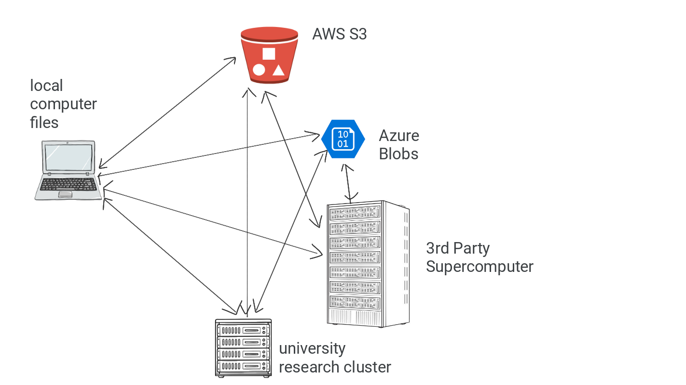
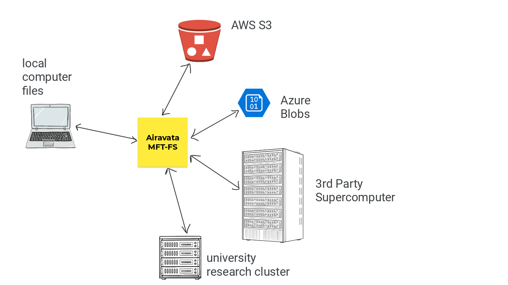
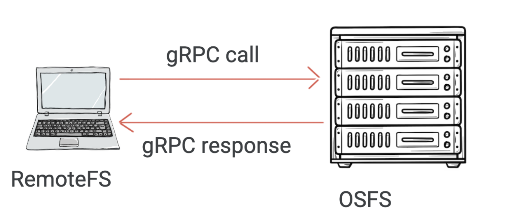
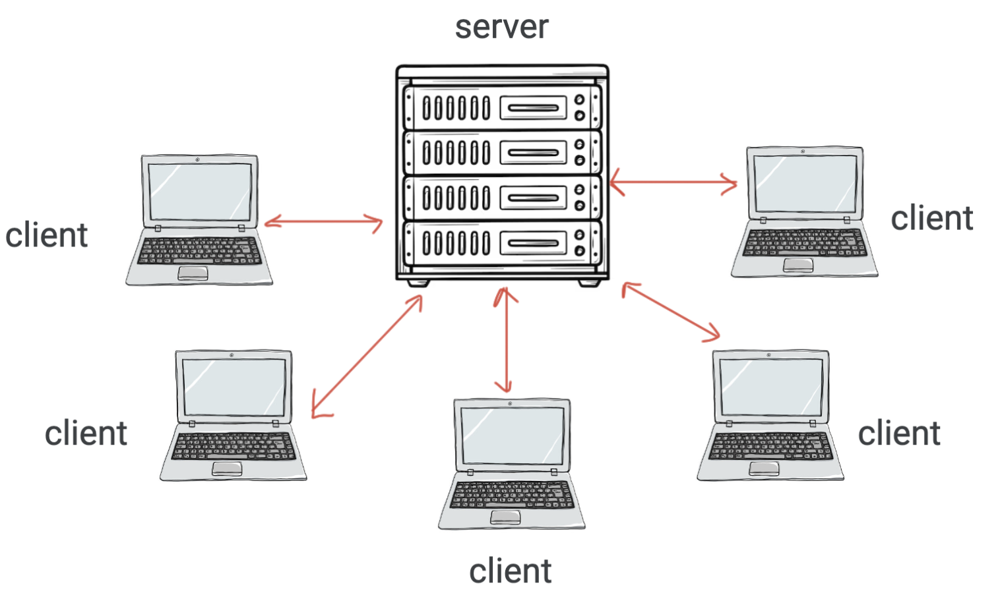

<h1>MFT-FS</h1>

<hr>

MFT-FS is a FUSE-based extension to Airavata MFT. It provides the abstraction that unifies the different file I/O protocols into one filesystem.

<strong>The Problem:</strong>


<br>

<strong>The Solution:</strong>


<hr>

<h3>Operating System Filesystem (OSFS)</h3>

This was more of a learning/testing implementation. It creates a filesystem mount which provides implementations for each fileystem method. However, the implementation has identical behavior to the native filesystem of the computer. It is merely a filesystem that mimics the operating system's filesystem.

<hr>

<h3>Remote Filesystem (RemoteFS)</h3>



This filesystem uses gRPC to exchange data between a client and a server. In this filesystem, the client has the FUSE mount running. The client's FUSE mount invokes FUSE operations remotely, using gRPC. Thus, all of the operations performed on the client will modify the server's operating system.

Note: RemoteFS is NOT threadsafe. Multiple clients reading and writing concurrently can cause race conditions and inconsistency.

<hr>

<h3>Safe Remote Filesystem (SafeRemoteFS)</h3>



This filesystem adds the safety layers on top of the remote filesystem. It uses a Concurrent Reads, Exclusive Writes (CREW) model. Prior to reading/writing a file, the client must request to read/write. This is a blocking operation. The server only grants access to the client when there are no writers. If a client is reading/writing, it is guaranteed that no other client can write at the same time. After a client is done reading/writing, it must send an acknowledgement.

<hr>

<h3>Instructions for RemoteFS</h3>

RemoteFS is a Filesystem supported over a gRPC-based TCP connection.

The following instructions assume Go v1.20.x and FUSE are installed on the system.

<ol>
<li><div>

Code can be installed using

```shell
git clone https://github.com/RohanPhadnis/airavata-mft.git
```

Perform all the steps below from the <code>airavata-mft/mft-fs</code> directory.
</div></li>

<li>
<div>
To get the <code>go.mod</code> file ready, use the following command:

```shell
cat gomod.txt > go.mod
```
</div>
</li>

<li>
<div>
To install all dependencies, run the following two commands:

```shell
go mod tidy
go install ./...
```
</div>
</li>

<li>
<div>
Before running, ensure you have the <code>mount</code> and <code>test</code> directories in the <code>main</code> directory.

```shell
mkdir mount
mkdir root
```
</div>
</li>

<li>
<div>
To run the server, use the command:

```shell
go run ./remotefs/servermain/server_main.go --rootDirectory ./root
```

This will run the server locally to interface with the FUSE client.

</div>
</li>

<li>
<div>
To run the client, allow the server to run in a terminal session. Open a new terminal and type:

```shell
go run ./remotefs/clientmain/client_main.go --mountDirectory ./mount
```
</div>
</li>

<li><div>
<strong>Important Final Step:</strong> Enjoy and report any bugs!
</div></li>
</ol>

<hr>

<h3>Instructions for OSFS</h3>

OSFS is a Filesystem Mount which uses the local operating system to interface with FUSE.

The following instructions assume Go v1.20.x and FUSE are installed on the system.

<ol>
<li><div>

Code can be installed using

```shell
git clone https://github.com/RohanPhadnis/airavata-mft.git
```

Perform all the steps below from the <code>airavata-mft/mft-fs</code> directory.
</div></li>

<li>
<div>
To get the <code>go.mod</code> file ready, use the following command:

```shell
cat gomod.txt > go.mod
```
</div>
</li>

<li>
<div>
To install all dependencies, run the following two commands:

```shell
go mod tidy
go install ./...
```
</div>
</li>

<li>
<div>
Before running, ensure you have the <code>mount</code> and <code>test</code> directories in the <code>main</code> directory.

```shell
mkdir mount
mkdir root
```
</div>
</li>

<li>
<div>
To run the project, use the command:

```shell
go run ./main/main.go --mountDirectory ./mount --rootDirectory ./root
```

This will mount the pass-through functions on the <code>./mount</code> directory. All operations will be computed and performed on <code>./root</code>

</div>
</li>

<li><div>
<strong>Important Final Step:</strong> Enjoy and report any bugs!
</div></li>
</ol>